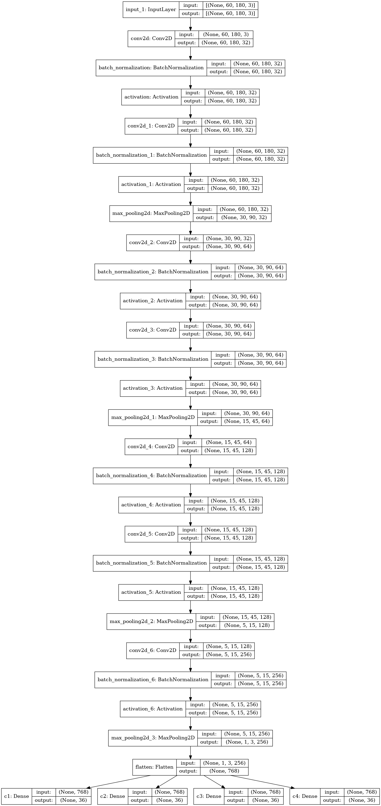
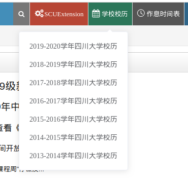
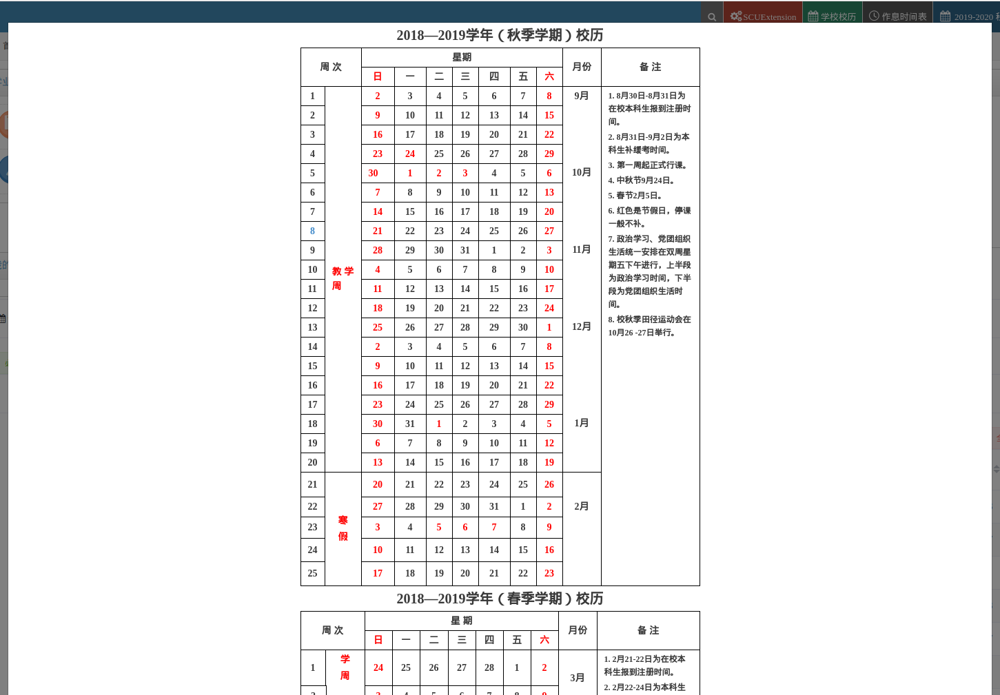

# SCUExtension
四川大学教务系统chrome插件

## 功能列表
> 教务系统
>> 两周内免登陆
>>
>> 系统首页绩点计算
>> 
>> 自动填写登录验证码
>>
>> 自动填写选课验证码
>>
>> 一键评教
>>
>> 校历显示优化
>>
> 
>课程中心
>> 修复chrome浏览器下姓名及退出不能点击的bug

大家有什么脑洞请提issue。

本项目已发布在chrome网上应用商店，搜索[**SCUExtension**](https://chrome.google.com/webstore/detail/scuextension/ljmkgohcdjeafplbnncbpekoomklkmen)即可。

## 更新日志

### 0.0.25
因google隐私协议，去除更新提示。

### 0.0.24
添加自动填写选课验证码

### 0.0.23
优化验证码识别网络，使用5\*5的空洞卷积核和1\*1的卷积核，代替原网络中的两个3\*3的卷积核，参数减少29.7%。模型大小由3M减小至2.1M。

### 0.0.22
登录页面插件加载逻辑更改。

校历显示优化

### 0.0.21
简化验证码识别网络，参数个数减少68.8%，模型大小由9.8M减小至3M，loss下降两个数量级。

优化模型加载逻辑。
### 0.0.20
验证码识别移入background.js与页面js分离，避免阻塞页面。

添加插件更新提示。
### 0.0.19
添加功能自动填写登录验证码。

验证码识别网络由tensorflow搭建。目前识别率在99.94%。
### 0.0.18
项目由gitlab迁移至github，删除敏感数据准备开源。
